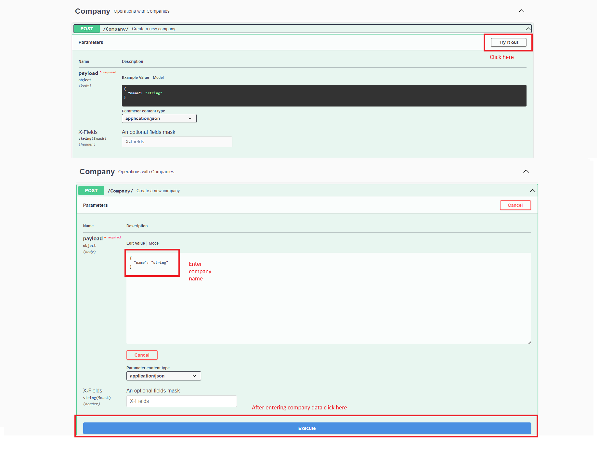
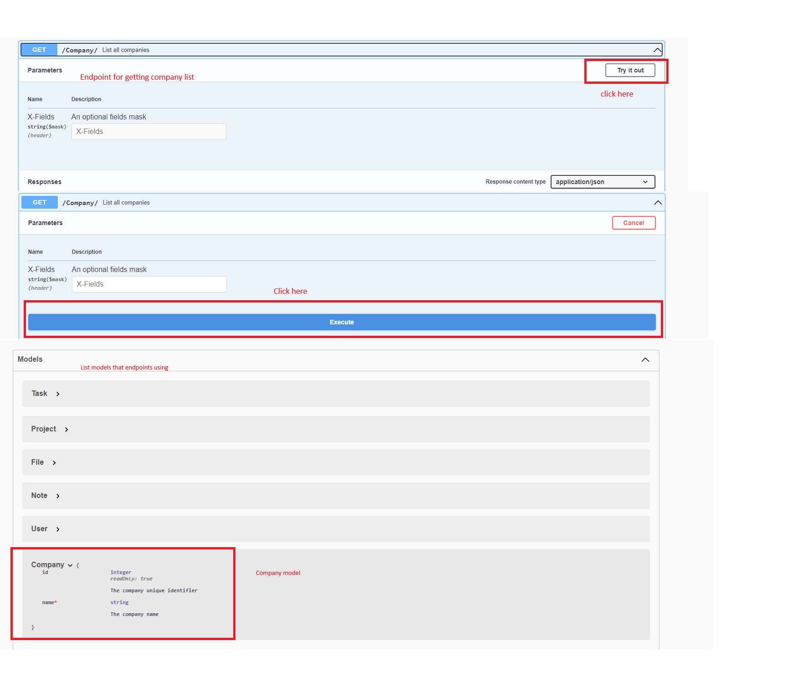

# Task hub API
The API for TaskHub

## Table of Contents

- [Introduction](#introduction)
- [Features](#features)
- [Installation](#installation)
  - [PostgreSQL](#postgresql)
    - [Linux](#linux)
      - [Ubuntu/Debian](#ubuntudebian)
    - [macOS](#macos)
      - [Homebrew](#homebrew)
    - [Windows](#windows)
- [Usage](#usage)
- [Deployment to Fly.io](#deployment-to-flyio)
- [API Endpoints](#api-endpoints)
- [Swagger Example](#example-in-swagger)

## Introduction

TaskHub is an API designed to manage tasks, projects, users, notes, files, and companies efficiently. It provides a comprehensive set of endpoints for CRUD operations and is built with scalability and flexibility in mind.

## Features

- User management with roles and company association.
- Task management with detailed descriptions.
- Project management to organize tasks.
- Note-taking functionality linked to tasks.
- File management for attaching documents to tasks and projects.
- Company management for user organization.

## Installation

### PostgreSQL

#### Linux

##### Ubuntu/Debian:

1. Update the package index:

   ```bash
   sudo apt-get update
   ```

2. Install PostgreSQL:

   ```bash
   sudo apt-get install postgresql postgresql-contrib
   ```

3. For more detailed instructions, refer to the [PostgreSQL Installation Guide for Ubuntu](https://www.postgresql.org/download/linux/ubuntu/).

#### macOS

##### Homebrew:

1. Install PostgreSQL using Homebrew:

   ```bash
   brew install postgresql
   ```

2. For more detailed instructions, refer to the [PostgreSQL Installation Guide for macOS](https://www.postgresql.org/download/macosx/).

#### Windows

1. Download the PostgreSQL installer from the [official website](https://www.postgresql.org/download/windows/).

2. Run the installer and follow the installation wizard.

3. During installation, set the PostgreSQL superuser password.

4. For more detailed instructions, refer to the [PostgreSQL Installation Guide for Windows](https://www.postgresql.org/download/windows/).

### API

1. **Clone the repository:**

   ```bash
   git clone https://github.com/djolertrk/taskhub-api.git
   git checkout -b develop remotes/origin/develop
   ```

2. **Navigate to the project directory:**

   ```bash
   cd taskhub-api
   ```

3. **Install dependencies:**

   ```bash
   pip install -r requirements.txt
   ```

or for Python3:

   ```bash
   pip3 install -r requirements.txt
   ```

## Usage

1. Start PostgreSQL service:

Linux:

   ```bash
   sudo service postgresql start
   ```

MAC:

   ```bash
   brew services start postgresql
   brew install postgres
   initdb /usr/local/var/postgres
   pg_ctl -D /opt/homebrew/bin/postgres start
   ```

Windows:

Start the PostgreSQL service from the Start menu.

If you see an error like `failed: FATAL:  password authentication failed for user "postgres"`, go to the PostgreSQL installation folder, find the `data` directory, open the `pg_hba.conf` file, and change all `METHOD` fields to `trust` (for development purposes only).

2. Start the Flask server (requires at least `python 3.11`):

   ```bash
   python -m flask run
   ```

Or python3 users:

   ```bash
   python3 -m flask run
   ```

To enable Flask debug mode:

```bash
export FLASK_DEBUG=1
```

3. Access the API at `http://127.0.0.1:5000`.

## Deployment to Fly.io

TaskHub API can be easily deployed to [Fly.io](https://fly.io/), a platform for running apps globally.

### Prerequisites

- [Fly.io Account](https://fly.io/)
- [Fly.io CLI Installed](https://fly.io/docs/hands-on/install-flyctl/)

### Quick Deployment Steps

1. Install Fly.io CLI:

   ```bash
   curl -L https://fly.io/install.sh | sh
   ```

2. Authenticate:

   ```bash
   fly auth login
   ```

3. Launch your app:

   ```bash
   fly launch
   ```

   - Choose app name and region.
   - When prompted to deploy now, select **No**.

4. Create a simple `Dockerfile` if needed:

   ```Dockerfile
   FROM python:3.11-slim

   WORKDIR /app
   COPY requirements.txt requirements.txt
   RUN pip install -r requirements.txt
   COPY . .

   ENV PORT 8080
   CMD ["flask", "run", "--host=0.0.0.0", "--port=8080"]
   ```

5. Set environment variables:

   ```bash
   fly secrets set DATABASE_URL=your_postgres_connection_string
   ```

6. Deploy:

   ```bash
   fly deploy
   ```

7. Open your app:

   ```bash
   fly open
   ```

Once it is deployed, you will get an APP link, then just replace this https://github.com/RJ-AUTONOMOUS/taskhub-app/blob/main/taskhub/src-tauri/src/lib.rs#L415 in frontend.

### More Details

For more detailed instructions on deploying apps to Fly.io, refer to their official documentation:  
👉 [Fly.io Documentation](https://fly.io/docs/hands-on/)

## API Endpoints

- **/task/**
  - `GET`: List all tasks
  - `POST`: Create a new task
  - `GET`: Get task by ID
  - `PUT`: Update task by ID
  - `DELETE`: Delete task by ID

- **/user/**
  - `GET`: List all users
  - `POST`: Create a new user
  - `GET`: Get user by ID
  - `PUT`: Update user by ID
  - `DELETE`: Delete user by ID

- **/project/**
  - `GET`: List all projects
  - `POST`: Create a new project
  - `GET`: Get project by ID
  - `PUT`: Update project by ID
  - `DELETE`: Delete project by ID

- **/file/**
  - `GET`: List all files
  - `POST`: Create a new file
  - `GET`: Get file by ID
  - `PUT`: Update file by ID
  - `DELETE`: Delete file by ID

- **/note/**
  - `GET`: List all notes
  - `POST`: Create a new note
  - `GET`: Get note by ID
  - `PUT`: Update note by ID
  - `DELETE`: Delete note by ID

- **/company/**
  - `GET`: List all companies
  - `POST`: Create a new company
  - `GET`: Get company by ID
  - `PUT`: Update company by ID
  - `DELETE`: Delete company by ID

## Example in swagger

We use `Swagger` to execute and test the API endpoints. After running the app with `python3 -m flask run`, simply open your browser and navigate to `http://127.0.0.1:5000` to access the tool. Here are some examples of creating inputs to the database:

**1. Company creation**





## Important

Please open `Swagger` and create a company with the name "freelance" - it is a special company, shared among all users. If the product is sold to a company that wants to have its own space, this table can be extended with other companies as well.

Also, regarding o365 integration, you need to register this application on Azure and to get:

`Application ID`
`Tenant ID`
`Client Secret`

And to enter those for the "freelance" company Table. For example, those info we got when testing the API:

```
curl -X 'PUT' \
  'http://127.0.0.1:5000/Company/1' \
  -H 'accept: application/json' \
  -H 'Content-Type: application/json' \
  -d '{
  "id": 1,
  "name": "freelance",
  "applicationId": "9ba1e932-4149-4d34-8769-b809bbf76420",
  "tenantId": "1efe0d54-fb56-4b09-9251-431f0f308e88",
  "clientSecret": "3f111d93-027f-4119-b0dc-3edfd38ca51d"
}'
```

See https://github.com/RJ-AUTONOMOUS/taskhub-api/tree/main/images/o365.
